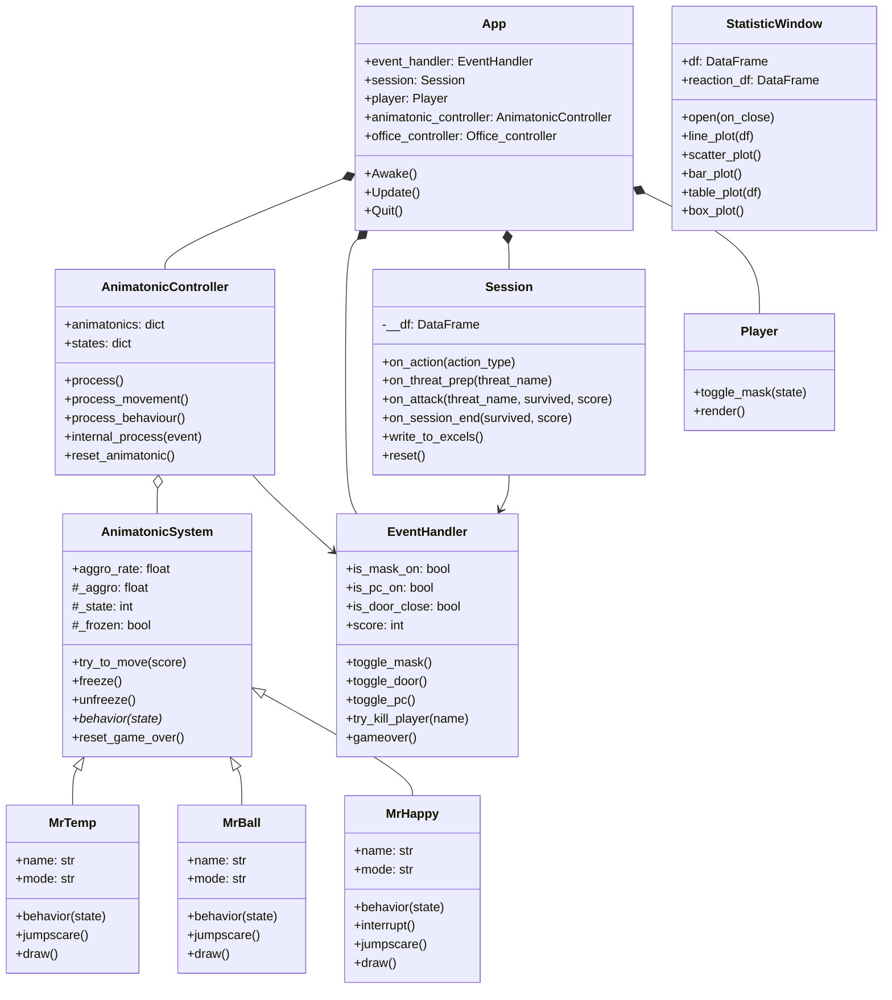

# Project Description

## 1 Project Overview
- **Project** : Unfortunately Time is not on the menu
- **Brief description** : A simple FNAF-inspired survival game. Fend off animatronics, each with their own distinct attack style, while racing to complete a minigame and reach a score of 100.

- **Problem Statement** 
This project doesn't address a specific problem. It's a lighthearted spin-off designed to offer a fresh take and break the monotony seen in recent FNAF entries.

- **Target user**
Players who enjoy the horror genre, specifically those who are fans of FNAF.

- **Key features**
- Animatronics — multiple enemies, each with unique attack behaviors
- Minigame — an interactive challenge players must complete to progress
- Statistics system — tracks player performance and in game data
- Dynamic difficulty — challenge scales as the players score increases

- **Screenshots:**
### Gameplay

### Data Visualization

- **Proposal:** [Project Proposal](./proposal.pdf)

## 2 Concept

### 2.1 Background
- **Reason** 
This project exist because of author addiction to fnaf fan game and the unending
urge to do one but with hisown creative spin.
- **Inspiration**
This project inspired from fnaf1, fnaf2 and fnaf3 with some additional fan game.

### 2.2 Objectives
- Build a playable fnaf game with somewhat fair and fun gameplay
- Make it fun for even for replaying
- Record meaningful gameplay statistics and present them through clear in game visualizations

## 3 UML Class diagram

## 4 OOP Implementation

### Inheritance
All 3 animatronics inherit from `AnimatonicSystem` which handles all the shared stuff — aggro buildup, freeze logic, and animation playback. Each one overrides `behavior()` to do its own thing with its own attack style and defense.

| Animatronic | Defense action | Attack condition |
|-------------|---------------|-----------------|
| MrTemp | Wear mask (`Space`) | Attacks if mask is **off** |
| MrBall | Close the door | Attacks if door is **open** |
| MrHappy | Turn off the PC | Attacks if PC is **on** |

### Encapsulation
- `Session` keeps the dataframe private so nothing touches it directly, everything goes through methods like `on_action()` or `on_attack()`
- `EventHandler` keeps all the game state in one place and only lets things change through its own methods
- `AnimatonicSystem` hides the event handler reference so animatronics can only trigger game over through `_gameover()`

### Polymorphism
`AnimatonicController` just calls `behavior()` on each animatronic without caring what type it is. Each one does something different — MrBall preps from the corner, MrHappy slides in through the PC screen, MrTemp creeps in from the side — but the controller treats them all the same.

### Composition
- `App` is basically a container that creates and holds everything — `EventHandler`, `Session`, `Player`, `AnimatonicController`, all the screens
- `MiniGame` uses `MiniGameLogic` to handle all the actual minigame logic separately from the rendering
- `StatisticWindow` uses a shared `_TkHost` to run the Tkinter window on its own thread

## 5 Statistical Data

### 5.1 Data recording method
The `Session` class handles all the recording. Every time the player does something or an animatronic attacks, it logs a row into a dataframe. At the end of each run it writes everything out to `Data.xlsx`.

Three types of events are recorded:

| Event type | When logged | Key fields captured |
|------------|------------|---------------------|
| Player action | Each input (Door, Mask, PC, Submit, TurnLeft, TurnRight) | Action state, session time, cumulative input count, score |
| Encounter | When an animatronic attacks | Threat name, aggro rate, survived, input count during prep, score |
| Session | On game-over or win | Total session duration, survived, final score, total inputs |

`on_threat_prep` and `on_attack` work together to count how many inputs the player made while an animatronic was approaching. Reaction time is calculated by looking at the gap between an Encounter row and the next action row after it.

### 5.2 Data Features
Both the `StatisticWindow` (Tkinter) and the in-game `StatisticScreen` generate five graphs from the recorded data:

| Graph | Type | What it shows |
|-------|------|---------------|
| **Reaction Time vs Score** | Line plot | How fast the player reacted to each animatronic at different score levels, split by survived or died |
| **Session Time vs Inputs** | Scatter plot | Whether longer or more active sessions tend to end in survival or death |
| **Action Frequency** | Bar plot | How many times the player used each action (Door, Mask, PC) across all sessions |
| **Success Rate per Animatronic** | Table | What percentage of encounters with each animatronic the player survived |
| **Input Burst by Time Interval** | Box plot | How many inputs the player made grouped by how fast they were pressing buttons |

The stats window also lets you filter by animatronic so you can look at one threat at a time.
