# Project Description

## 1 Project Overview
- **Project** : Unfortunately Time is not on the menu

- **Brief description** 
A simple FNAF-inspired survival game. Fend off animatronics, each with their own distinct attack style, while racing to complete a minigame and reach a score of 100.

- **Problem Statement** 
This project doesn't address a specific problem. It's a lighthearted spin-off designed to offer a fresh take and break the monotony seen in recent FNAF entries.

- **Target user**
Players who enjoy the horror genre, specifically those who are fans of FNAF.

- **Key features**
Animatronics — multiple enemies, each with unique attack behaviors
Minigame — an interactive challenge players must complete to progress
Statistics system — tracks player performance and in game data
Dynamic difficulty — challenge scales as the players score increases

- **Screenshots:**
### Gameplay
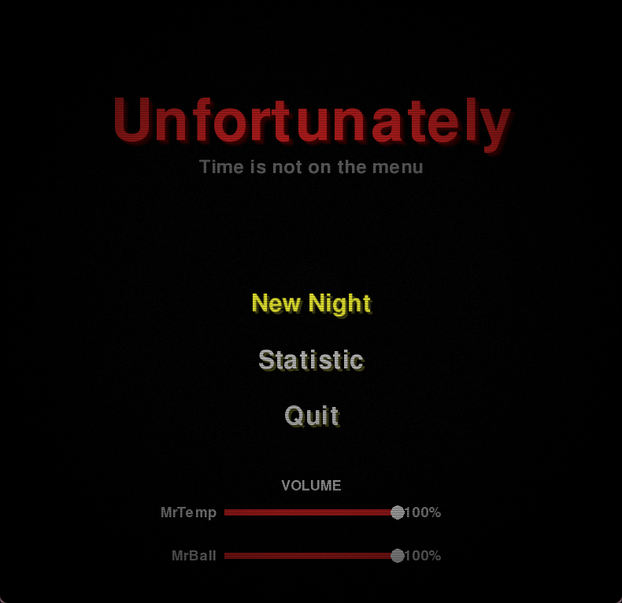
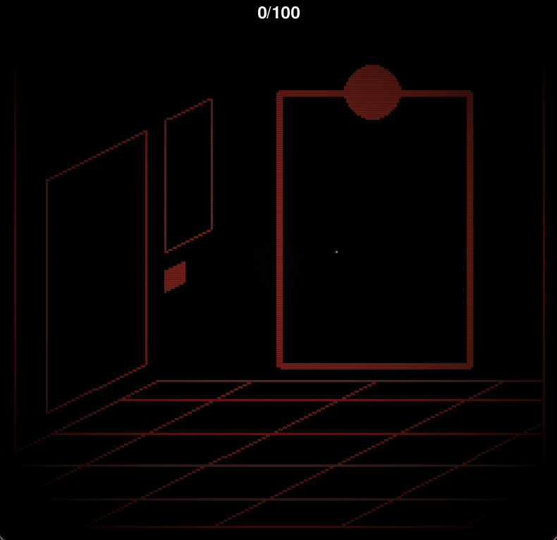
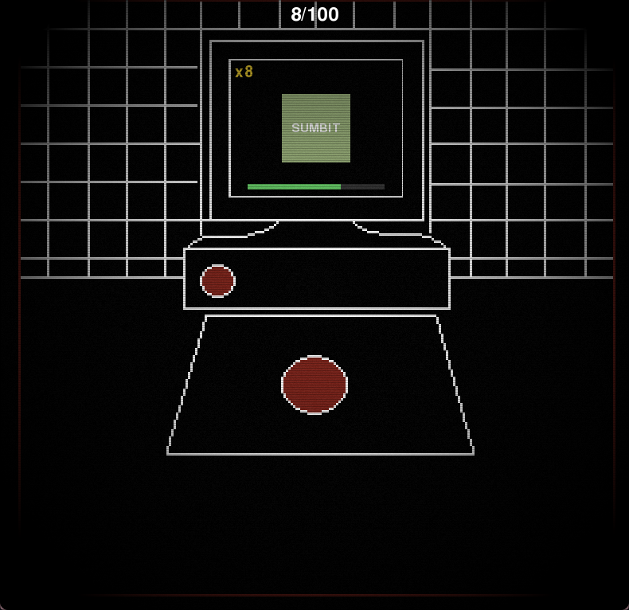
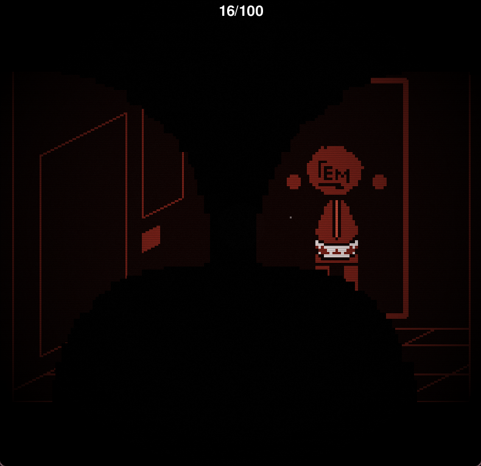
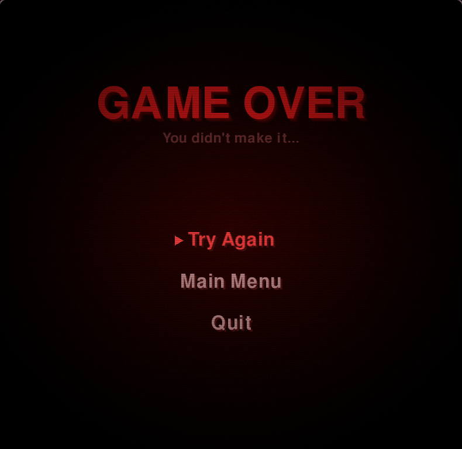
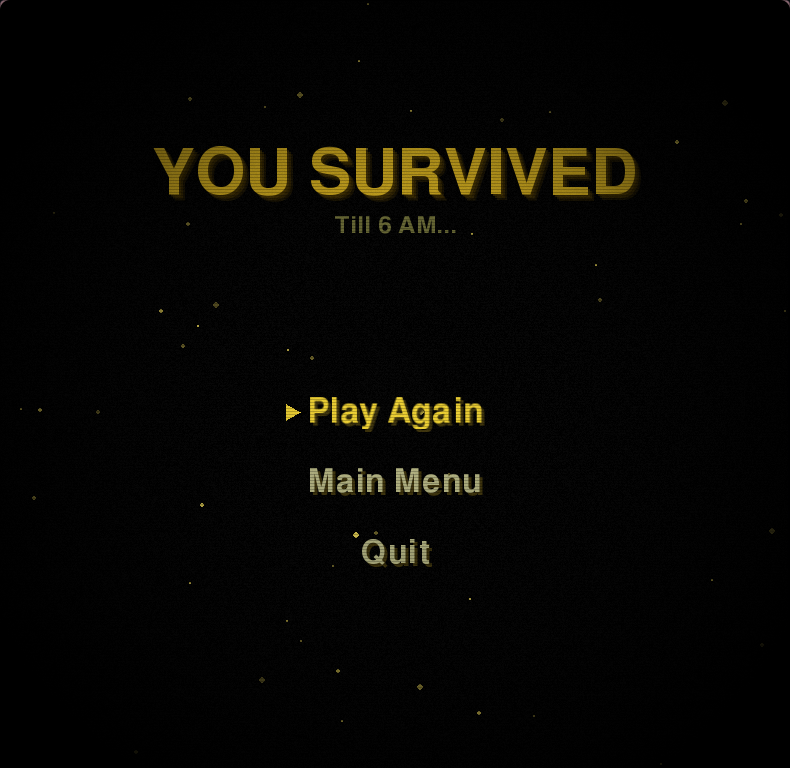

### Data Visualization
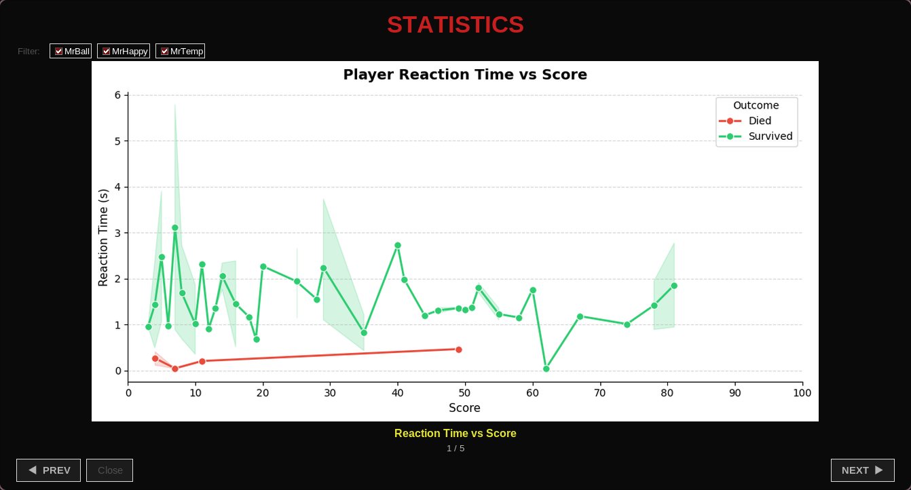
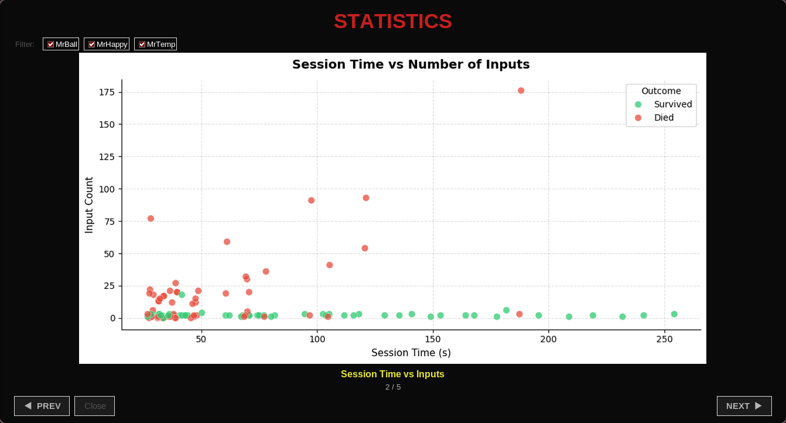
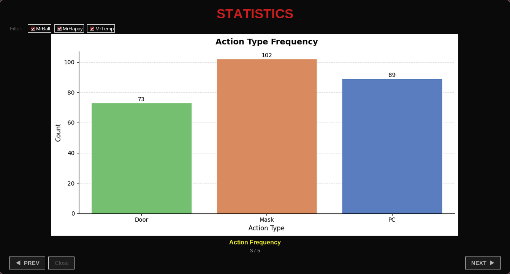
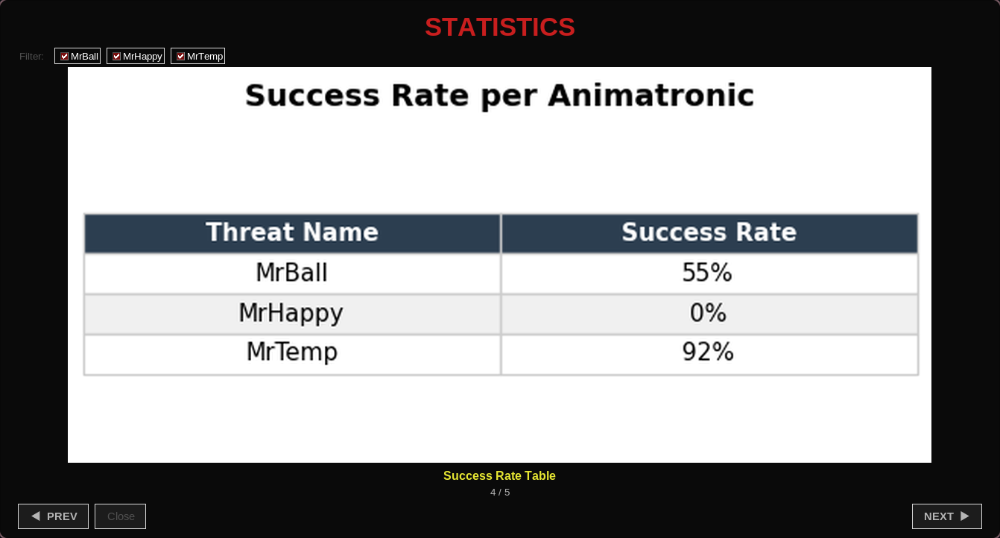
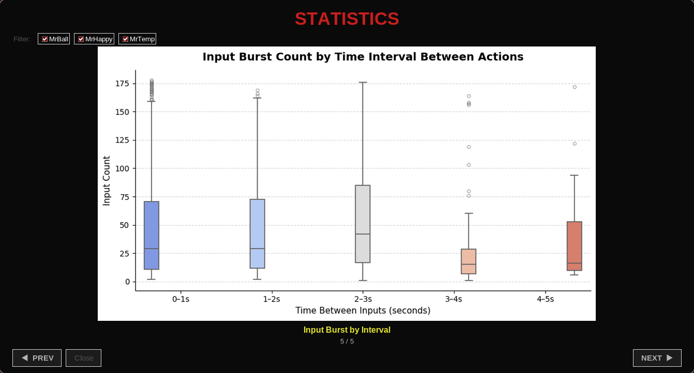

- **Proposal:** [Project Proposal](./Proposal.pdf)

## 2 Concept

### 2.1 Background
- **Reason** 
This project exist because of author addiction to fnaf fan game and the unending
urge to do one but with hisown creative spin.
- **Inspiration**
This project inspired from fnaf1, fnaf2 and fnaf3 with some additional fan game.

### 2.2 Objectives
- Build a playable fnaf game with somewhat fair and fun gameplay
- Make it fun for even for replaying
- Record meaningful gameplay statistics and present them through clear in game visualizations

## 3 UML Class diagram

## 4 OOP Implementation

 `App` -> Main entry point. Creates and runs all subsystems in the game loop
 `AnimatonicSystem` -> Base class for all animatronics. Handles aggro buildup, freeze logic, and animation
`MrTemp` -> Animatronic that attacks from the office side. Countered by wearing the mask
`MrBall` -> Animatronic that rolls in from the corner. Countered by closing the door
`MrHappy` -> Animatronic that appears through the PC screen. Countered by turning the PC off
`AnimatonicController` -> Manages all animatronics, handles movement timing, cooldowns, and attack events
`EventHandler` -> Holds all game state — mask, door, PC, score, facing direction
`Session` -> Records every player action and encounter into a dataframe and writes to `Data.xlsx`
`Player` -> Handles the mask visual on the player
`MiniGame` -> Renders the minigame surface and passes input to `MiniGameLogic`
`MiniGameLogic` -> Handles the actual minigame logic — scoring, timing, and feedback
`Office_controller` -> Manages the office and backroom rendering and state
`StatisticWindow` -> Tkinter window that generates and displays all 5 data visualizations
`StatisticScreen` -> In-game pygame overlay version of the stats display
`Animation` -> Loads and plays sprite sheet animations
`TitleScreen` -> Handles the main menu including volume sliders and navigation
`GameOverScreen` -> Handles the game over screen and retry/menu options
`WinScreen` -> Handles the win screen and play again/menu options
`StaticOverlay` -> Draws the static noise effect over the screen
`DebugOverlay` -> Shows debug info like animatronic states when F3 is pressed

## 5 Statistical Data

### 5.1 Data recording method
The `Session` class handles all the recording. Every time the player does something or an animatronic attacks, it logs a row into a dataframe. At the end of each run it writes everything out to `Data.xlsx`.

Three types of events are recorded:

| Event type | When logged | Key fields captured |
|------------|------------|---------------------|
| Player action | Each input (Door, Mask, PC, Submit, TurnLeft, TurnRight) | Action state, session time, cumulative input count, score |
| Encounter | When an animatronic attacks | Threat name, aggro rate, survived, input count during prep, score |
| Session | On game-over or win | Total session duration, survived, final score, total inputs |

`on_threat_prep` and `on_attack` work together to count how many inputs the player made while an animatronic was approaching. Reaction time is calculated by looking at the gap between an Encounter row and the next action row after it.

### 5.2 Data Features
Both the `StatisticWindow` (Tkinter) and the in-game `StatisticScreen` generate five graphs from the recorded data:

| Graph | Type | What it shows |
|-------|------|---------------|
| **Reaction Time vs Score** | Line plot | How fast the player reacted to each animatronic at different score levels, split by survived or died |
| **Session Time vs Inputs** | Scatter plot | Whether longer or more active sessions tend to end in survival or death |
| **Action Frequency** | Bar plot | How many times the player used each action (Door, Mask, PC) across all sessions |
| **Success Rate per Animatronic** | Table | What percentage of encounters with each animatronic the player survived |
| **Input Burst by Time Interval** | Box plot | How many inputs the player made grouped by how fast they were pressing buttons |

The stats window also lets you filter by animatronic so you can look at one threat at a time.

## 6 External Sources

### Sound Effects
All sound effects are from Pixabay under the [Pixabay Content License](https://pixabay.com/service/license-summary/) which allows free use without attribution.

- Sound Effect by [DRAGON-STUDIO](https://pixabay.com/users/dragon-studio-38165424/?utm_source=link-attribution&utm_medium=referral&utm_campaign=music&utm_content=401729) from [Pixabay](https://pixabay.com/?utm_source=link-attribution&utm_medium=referral&utm_campaign=music&utm_content=401729) — used for MrTemp's appear sound
- Sound Effect by [DRAGON-STUDIO](https://pixabay.com/users/dragon-studio-38165424/?utm_source=link-attribution&utm_medium=referral&utm_campaign=music&utm_content=397987) from [Pixabay](https://pixabay.com/?utm_source=link-attribution&utm_medium=referral&utm_campaign=music&utm_content=397987) — used for MrBall's appear sound

### Art
All sprites, animations, and backgrounds are original work by the author.
